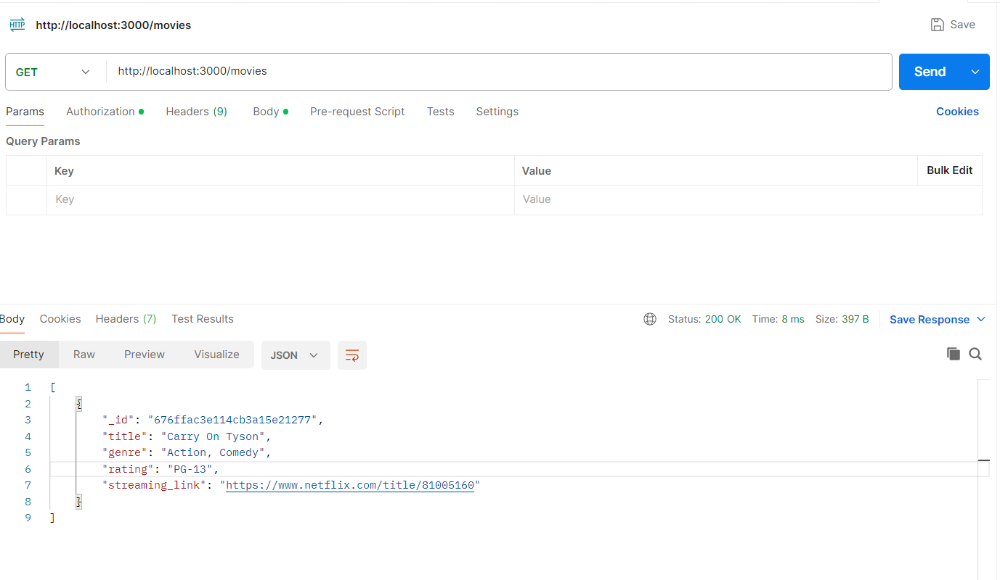
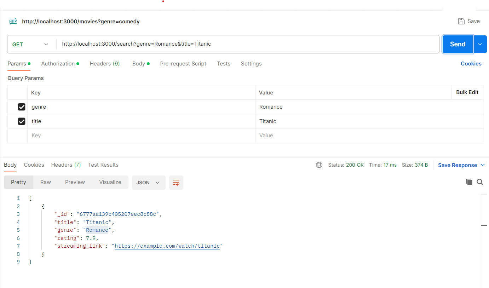
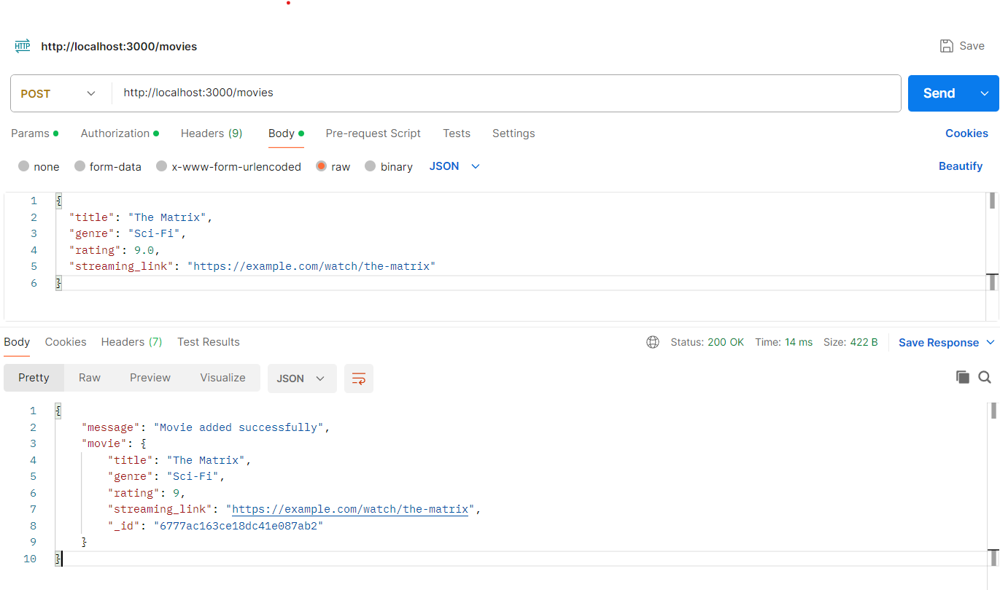
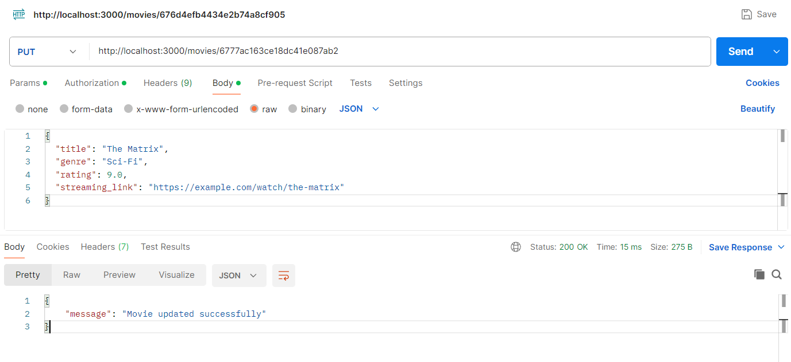
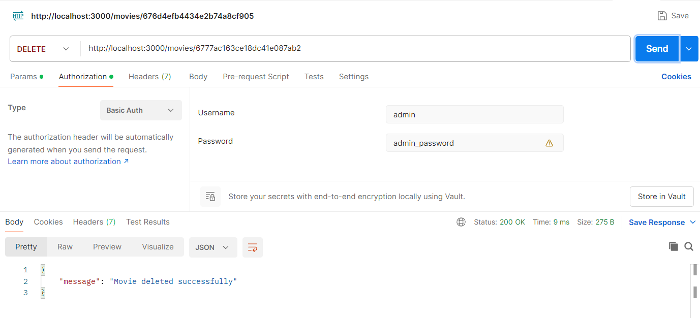

# Backend-API-Movie-Lobby

This is a simple Movies Lobby API built using Node.js, Express, and MongoDB. It allows users to interact with a movie database, including fetching a list of movies, searching, and more.

## Prerequisites

- [Node.js](https://nodejs.org/) (version 14 or higher)
- [MongoDB](https://www.mongodb.com/try/download/community) (local or MongoDB Atlas)

## Setup

### 1. Clone the Repository

```bash
git clone https://github.com/kprasannamahesh/Backend-API-Movie-Lobby.git
cd Backend-API-Movie-Lobby
```

### 2. Install Dependencies

```bash
npm install
```

### 3. Set Up Environment Variables

Create a `.env` file and define the following variables:

```env
MONGO_URI=mongodb://<admin>:<password>@localhost:27017
ADMIN_USER=your_admin_user
ADMIN_PASSWORD=your_admin_password
```

### 4. Run the Application

```bash
npm start
```

### 5. Run Tests

```bash
npm test
```

## Folder Structure

```
/src
|-- /connection        # MongoDB connection logic
|-- db.ts              # Database configuration and connection
|-- /routes            # API route definitions
|-- express_router.test.ts # Test cases for API routes
|-- express_router.ts  # Express routes for API
|-- envVaraibles.ts    # Environment variable configuration
|-- index.ts           # Main application entry point
/.env                  # Environment variables
/.gitignore            # Git ignore file
/jest.config.js        # Jest testing configuration
/load_data.json        # Sample data for database seeding
/nodemon.json          # Configuration for Nodemon
/package-lock.json     # NPM lock file
/package.json          # Project dependencies and scripts
/tsconfig.json         # TypeScript configuration
```


# Movie Lobby API Documentation

This API allows interaction with a movie lobby for OTT applications, including listing, searching, and managing movies. 

## Base URL
```
http://localhost:3000/
```

---

## Endpoints

### 1. **List All Movies**
- **Endpoint**: `GET /movies`
- **Description**: Retrieves a list of all movies in the lobby.
- **Request Parameters**: None.
- **Response Example**:
  ```json
  [
    {
      "id": 1,
      "title": "Inception",
      "genre": "Sci-Fi",
      "rating": 8.8,
      "streaming_link": "https://example.com/watch/inception"
    },
    {
      "id": 2,
      "title": "Titanic",
      "genre": "Romance",
      "rating": 7.9,
      "streaming_link": "https://example.com/watch/titanic"
    }
  ]
  ```
- **Postman Example**:
  

---

### 2. **Search Movies**
- **Endpoint**: `GET /search?q={query}`
- **Description**: Searches for movies by title or genre.
- **Query Parameter**:
  - `q` (required): The search term (title or genre).
- **Response Example**:
  ```json
  [
    {
      "id": 1,
      "title": "Inception",
      "genre": "Sci-Fi",
      "rating": 8.8,
      "streaming_link": "https://example.com/watch/inception"
    }
  ]
  ```
- **Postman Example**:
  

---

### 3. **Add a New Movie**
- **Endpoint**: `POST /movies`
- **Description**: Adds a new movie to the lobby (requires "admin" role).
- **Request Headers**:
  - `Authorization`: Basic Auth with admin credentials.
- **Request Body** (JSON):
  ```json
  {
    "title": "The Matrix",
    "genre": "Sci-Fi",
    "rating": 9.0,
    "streaming_link": "https://example.com/watch/the-matrix"
  }
  ```
- **Response Example**:
  ```json
  {
    "message": "Movie added successfully",
    "movie": {
        "title": "The Matrix",
        "genre": "Sci-Fi",
        "rating": 9,
        "streaming_link": "https://example.com/watch/the-matrix",
        "_id": "6777ac163ce18dc41e087ab2"
    }
  }
  ```
- **Postman Example**:
  

---

### 4. **Update a Movie**
- **Endpoint**: `PUT /movies/:id`
- **Description**: Updates an existing movie's information (requires "admin" role).
- **Request Headers**:
  - `Authorization`: Basic Auth with admin credentials.
- **Request Body** (JSON):
  ```json
  {
    "title": "The Matrix Reloaded",
    "genre": "Sci-Fi",
    "rating": 8.5,
    "streaming_link": "https://example.com/watch/the-matrix-reloaded"
  }
  ```
- **Response Example**:
  ```json
  {
    "message": "Movie updated successfully."
  }
  ```
- **Postman Example**:
  

---

### 5. **Delete a Movie**
- **Endpoint**: `DELETE /movies/:id`
- **Description**: Deletes a movie from the lobby (requires "admin" role).
- **Request Headers**:
  - `Authorization`: Basic Auth with admin credentials.
- **Response Example**:
  ```json
  {
    "message": "Movie deleted successfully."
  }
  ```
- **Postman Example**:
  

---
## Error Responses

Standard error responses for the API:
- **401 Unauthorized**: Missing or invalid credentials.
  ```json
  {
    "error": "Unauthorized"
  }
  ```
- **404 Not Found**: The movie ID does not exist.
  ```json
  {
    "error": "Movie not found"
  }
  ```
- **400 Bad Request**: Invalid request data.
  ```json
  {
    "error": "Bad request"
  }
  ```

---

## License

This project is licensed under the MIT License.

---
